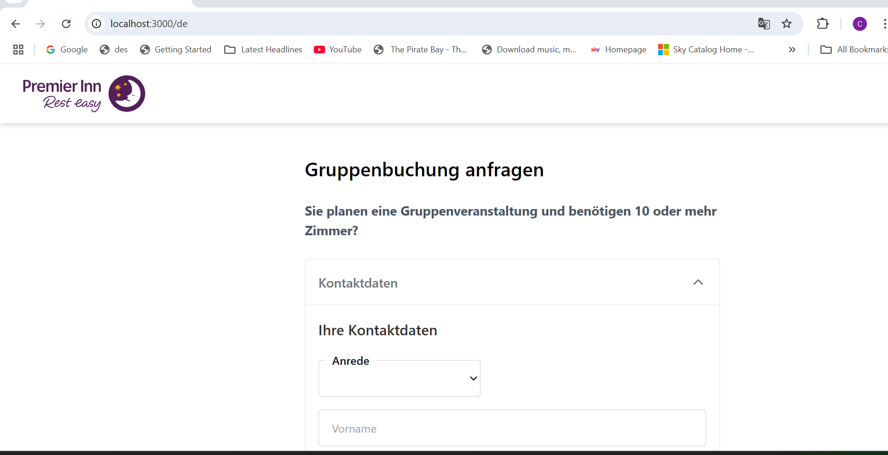

This is a [Next.js](https://nextjs.org/) project bootstrapped with [`create-next-app`](https://github.com/vercel/next.js/tree/canary/packages/create-next-app).

## Getting Started

First, run the development server:

```bash
npm run dev
# or
yarn dev
# or
pnpm dev
# or
bun dev
```

Open [https://hotel-booking-git-main-chetanpls-projects.vercel.app/en](https://hotel-booking-git-main-chetanpls-projects.vercel.app/en) with English language
Open [https://hotel-booking-git-main-chetanpls-projects.vercel.app/en](https://hotel-booking-git-main-chetanpls-projects.vercel.app/en) with Germon language
Here are the screenshots: I have added the German Language screenshots more.

Desktop view


Mobile view


# Core Requirements

Here’s your list with both ✅ completed and ⏳ pending tasks:

## 1. ✅ Internationalisation (i18n)
Render UK (en GB) and German (de DE) variants with a language switcher. Use an i18n library such as `next-intl`, `next-translate`, or the built-in `app/i18n` pattern.

## 2. ✅ Rendering & Performance
Deliver the initial page via SSR or ISR, add a sensible caching strategy (e.g. HTTP cache headers, static props revalidation) and measure performance (Lighthouse/Web Vitals).

## 3. ✅ Form Behaviour & Validation
Implement client- and server-side validation with inline, field-level error messages that clearly indicate how to resolve issues. Libraries such as Zod/Yup + React Hook Form are welcome.

## 4. ✅ Accessibility (a11y)
Achieve at least WCAG 2.2 AA compliance (semantic HTML, focus order, ARIA where required, color contrast, keyboard navigation). Add automated checks (e.g. eslint-plugin-jsx-a11y, axe-core).

## 5. ✅ State & Architecture
Use TypeScript throughout, apply a clean component hierarchy, consider state management via React Context/Hooks (or a library of your choice), and demonstrate code organisation suitable for scale.

## 6. ⏳ Testing
Provide unit tests (`Jest + React Testing Library`) and at least one end-to-end scenario (`Cypress` or `Playwright`). Include accessibility tests where feasible.

## 7. ⏳ Mock API Layer
Simulate API endpoints for GET content and POST submissions (`MSW` or `Next.js Route Handlers`). Persist form data in memory or JSON for local dev.

## 8. ⏳ CI & Tooling
Add a minimal GitHub Actions workflow (install, lint, test). Pre-commit hooks (`lint-staged`, `husky`) are a plus.

## 9. ⏳ Progressive Enhancement
Ensure the form works without JavaScript (graceful degradation) and is fully responsive across common breakpoints.

## 10. ⏳ Improvements & Innovation
Feel free to add enhancements such as dark mode, real-time form progress, typeahead address lookup, analytics event hooks, or Storybook docs. Mark these clearly as Stretch Goals in your README.
